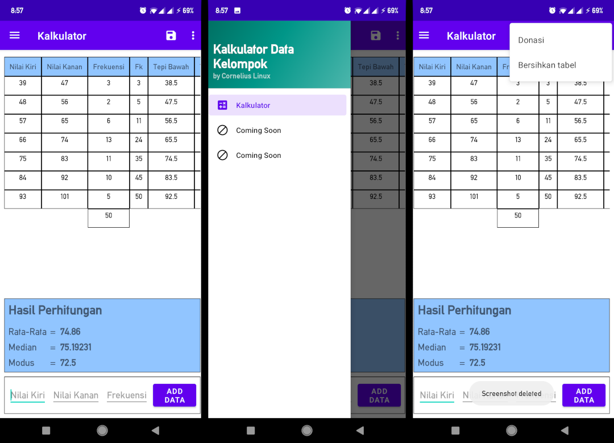

# Kalkulator Data Kelompok

Sebuah aplikasi kalkulator berbasis Android untuk menghitung mean, modus, dan median dari sebuah tabel distribusi frekuensi.

## Language
* Bahasa Indonesia

## Preview

## Kegunaan

* Menghitung mean, median, dan modus

## Instalasi
1. Silahkan download apknya [Disini](https://github.com/krossmanzs/Kalkulator-Data-Kelompok/releases).
2. Install apk seperti biasa.

## TO-DO
- [x] Membuat aplikasi kalkulator data kelompok
- [ ] Menghitung kuartil, desil, dan persentil
- [ ] Fitur save
- [ ] Fitur history
- [ ] Implementasi unit test

## Kontribusi
Karena saya baru pertama kali memakai github :v

Silahkan jika ingin kontribusi :)

## License
[MIT](https://choosealicense.com/licenses/mit/)
